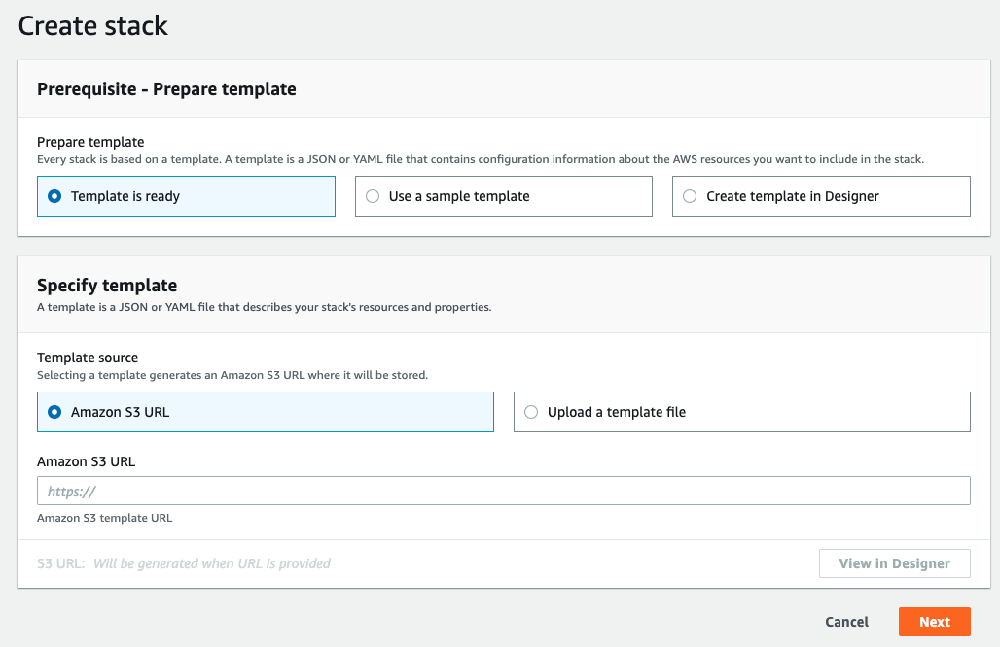
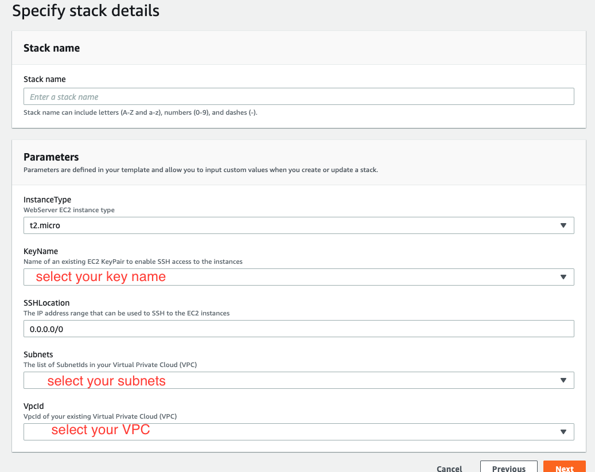
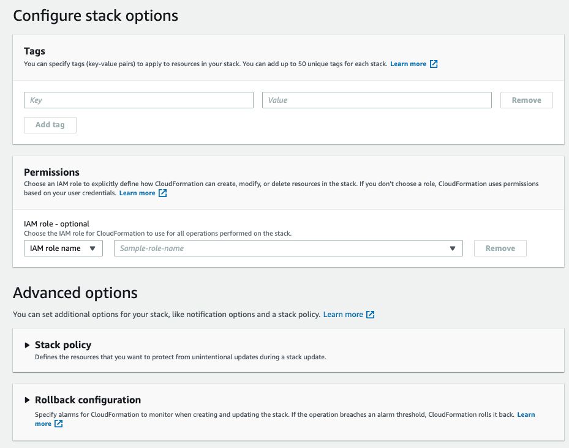
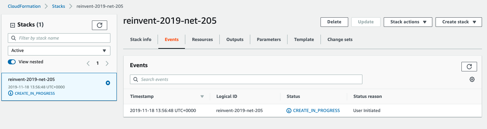

## Lab 0 - Launch the Stack

### 1. Launch the stack

#### 1.1 Start

Region | Button
------------ | -------------
us-west-2 | 

Region | Button
------------ | -------------
eu-west-1 | 

#### 1.2 Step "Select Template"

Upload the template file, select the template and click Click "Next"

<kbd></kbd>

#### 1.3 Step "Specify Details", click "Next"

<kbd></kbd>

#### 1.4 Step "Options", click "Next"

<kbd></kbd>

#### 1.5 Step "Review and Create the stack", click "Next"

<kbd></kbd>
